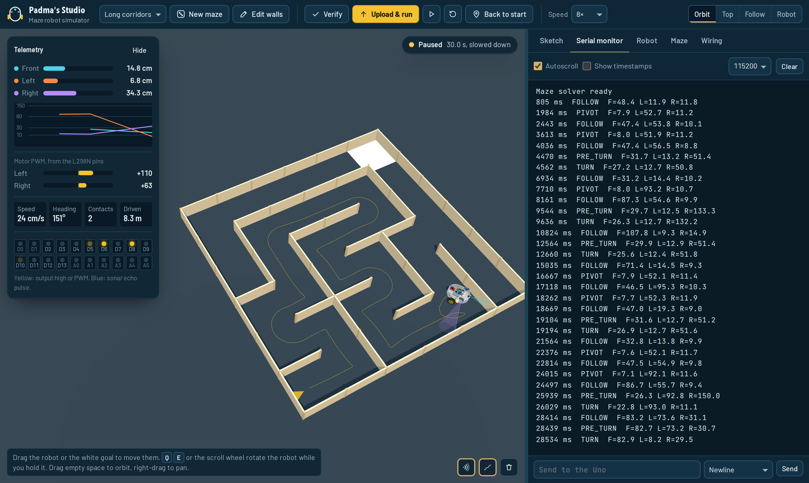

# Arduino maze robot simulator



A browser simulator for a three-sonar Arduino maze robot. You write ordinary Arduino C++, the page compiles it, and it runs on a virtual Arduino Uno that drives an L298N motor driver and reads three HC-SR04 ultrasonic sensors, in a 3D maze with physics.

The robot is modelled on a real build: two clear acrylic plates on brass standoffs, yellow TT gear motors, a swivel caster, an 8 × AA pack, an Uno, an L298N and a lot of jumper wires.

**Live demo:** `https://<your-user>.github.io/<repo-name>/` (after you deploy it, see below)

## What it does

- **Compiles real Arduino C++ in the browser.** A preprocessor (`#include`, `#define`, `#if`), a parser and a compiler turn the sketch into JavaScript closures. It never uses `eval`. Errors read like avr-gcc's and you can click them to jump to the line.
- **Behaves like an Uno.** `int` is 16 bits, so `200 * 200` is −25536, with gcc's overflow warning. `analogWrite(pin, 300)` wraps to 44, just as on the real chip. Programs over 2 KB of RAM are rejected.
- **Models the hardware timing.** HC-SR04 echoes take 58 µs per cm, and a missed echo holds ECHO high for about 38 ms. `pulseIn` timeouts behave as on the board, trigger pulses shorter than 10 µs are ignored, and `Serial` blocks at the chosen baud rate.
- **Simulates the physics.** The motors have lag, a dead band and a slight left/right mismatch. The wheels drive differentially and bump into walls. Each sonar is a cone of rays that misses walls hit at steep angles, with optional noise and dropouts.
- **Gives you tools to see what's going on.**
  - Live telemetry, a sonar history plot, the state of every Uno pin and a serial monitor.
  - Four camera views, including the robot's own view from its front sonar.
  - A wall editor, draggable robot and goal, and settings for the maze, robot and wiring.
  - Buttons that update `config.h` when your settings no longer match it.
- **Ships with a tested solver.** The default sketch is a right-hand wall follower with PD steering and calibrated corner arcs. It solves every maze in the benchmark below.

## Run it locally

You need Node.js 20.19 or newer.

```bash
npm install
npm run dev        # http://localhost:5173
npm run build      # typecheck, then a production build in dist/
npm run typecheck  # tsc --noEmit
npm run lint       # eslint .
npm run bench      # run the default solver on 24 random mazes, no browser needed
npm run golden     # regression check for engine features the default solver doesn't exercise
```

`npm run bench -- --size 8 --cell 50 --seeds 20 --types backtracker,prim,braid` changes the maze size, wall gap and maze types.

Current results for the default sketch:

| Mazes | Solved | Median time | Wall contacts per run |
|---|---|---|---|
| 6 × 6, 40 cm gap | 24 / 24 | 40.3 s | 0.13 |
| 8 × 8, 40 cm gap | 12 / 12 | 72.7 s | 0.00 |
| 6 × 6, 30 cm gap | 12 / 12 | 29.0 s | 0.75 |

Mazes with loops ("With loops" in the app) can trap a wall follower, which is a good first challenge.

## Deploy to GitHub Pages

1. Create a repository on GitHub and push this folder to its `main` branch.
2. In the repository, open **Settings > Pages** and set **Source** to **GitHub Actions**.
3. Push to `main` again, or run the workflow from the **Actions** tab.

The workflow in `.github/workflows/deploy.yml` installs dependencies, runs `npm test` to check that the solver still works, builds the site and publishes it. When it's done, the site is at `https://<your-user>.github.io/<repo-name>/`.

The build fills in the link-preview tags with your site's address, so a shared link shows `public/og-image.png`. After deploying, paste the URL into LinkedIn's [Post Inspector](https://www.linkedin.com/post-inspector/) to check the preview and refresh LinkedIn's cache. The GitHub icon in the top bar links to your repository automatically.

## How it works

```
maze_solver.ino + config.h
        │  engine/parser.ts     preprocess, tokenise, parse to an AST
        ▼
      AST
        │  engine/compiler.ts   closures; code that can block becomes generators
        ▼
 main() generator ──runs on──▶ engine/mcu.ts   pins, PWM, L298N, sonar timing, Serial
                                     │ motor duty          ▲ echo times
                                     ▼                     │
                               engine/world.ts   physics, collisions, sonar raycasts
                                     │
sim/SimController.ts  ◀── tick(dt) ── three/SceneView.ts   draws the scene every frame
        │  subscribe / getSnapshot
        ▼
   React components (src/components)
```

Every frame, the controller runs the sketch until the virtual Uno's clock reaches the end of the frame, then advances the physics to the same moment. `delay()`, `pulseIn()` and loops yield, so a sketch with `while (true)` doesn't freeze the page.

The engine has no DOM or React dependency. `scripts/bench.js` imports it directly in Node (via [tsx](https://github.com/privatenumber/tsx), since Node itself doesn't run `.ts` files).

The whole app - engine included - is TypeScript. `scripts/golden.js` (`npm run golden`) is a second regression check alongside bench: it compiles and runs a handful of small sketches covering language features the default solver never exercises (structs, enum class, overload resolution, static locals, String methods, NewPing timing) and diffs the result against a committed snapshot.

## Project structure

```
src/
  engine/        the simulator core: parser, compiler, Uno model, maze, physics
  sketch/        the default solver (maze_solver.ino, config.h), loaded as text
  sim/           SimController (app state, build and run), config.h sync, serial buffer
  three/         3D scene: robot model, maze meshes, sonar beams, camera views, input
  components/    React UI: top bar, stage overlays, editor, output, settings tabs
  hooks/         useSim (controller state), useTicker, shortcuts, media queries
  styles/        design tokens and layout CSS
scripts/bench.js   headless solver benchmark (also used by CI)
scripts/golden.js  regression snapshot for engine features the solver doesn't exercise
```

In a dev build, `window.mazeSim` is the controller, so you can poke at the simulation from the browser console, for example `mazeSim.world.pose` or `mazeSim.setUi({ speed: 8 })`. It isn't exposed in production builds.

## Arduino C++ support

Supported: `int`, `long`, `unsigned`, `byte`, `char`, `bool`, `float` and `double` (as on the Uno), `String`, arrays including 2D, `struct`, `enum` and `enum class`, `typedef`, references, default arguments, overloading, `static` locals, `switch`, all operators, `F()`, `PROGMEM` (ignored), `Serial`, the `NewPing` library, and the usual built-ins (`pinMode`, `digitalWrite`, `analogWrite`, `pulseIn`, `millis`, `map`, `constrain`, maths functions and more).

Not supported: pointers, classes with methods, templates, interrupts (there are no encoders on this robot), and libraries other than `NewPing`.

## Tuning for a real robot

The default sketch works out its distances and turn timing from four values in `config.h`. Measure them on your robot:

- `CELL_CM`: the gap between wall centres.
- `TRACK_CM`: the distance between the wheel centres.
- `SENSOR_SPAN`: the distance between the faces of the left and right sonars.
- `CM_S_PER_PWM`: drive straight for 2 s at `BASE_PWM` and use the distance travelled, as described in the comment.

If the robot drifts, adjust `LEFT_TRIM` or `RIGHT_TRIM`.

## Licence

MIT, see [LICENSE](LICENSE). three.js and React are MIT licensed too.
